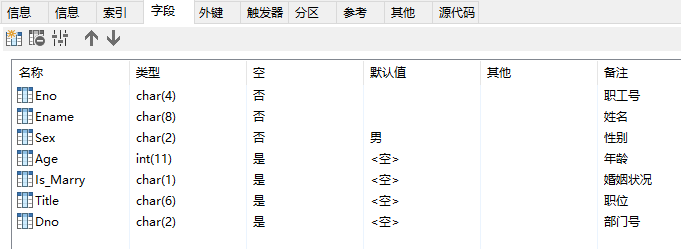
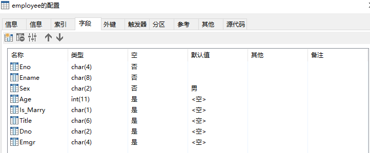
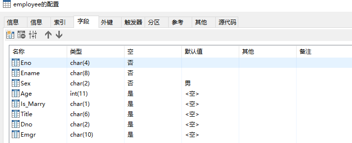
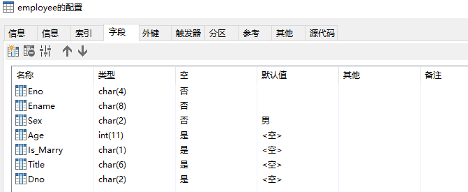

### DDL(Data Definition Language)
#### 关键字:create alter drop
+ 创建基本表|CREATE TABLE
	1. 基本格式:
	```
	CREATE TABLE<表名>
	(<列定义清单>);
	```
	2. 说明:
	```
	<表名>:在数据库中唯一的表名
	<列定义清单>:<列名><数据类型>[<默认值>|<标识列设置>][<该列的完整性约束>][<备注>]
	<列名>:在表中唯一的列名
	<数据类型>:该列的数据类型(INT,SMALLINT,DECIMAL(p,q),FLOAT,CHAR(n),VARCHAR(n),DATETIME...)
	<默认值>:DEFAULT 常量表达式
	<标识列设置>:IDENTITY(初始值，步长值)
	<该列的完整性约束>:(NOT NULL)|(NULL)|(UNIQUE)
	<备注>:COMMENT 常量表达式
	```
	3. 示例：创建Employee表
	```
	CREATE TABLE `Employee` (
	  `Eno` char(4) NOT NULL  COMMENT '职工号',
	  `Ename` char(8) NOT NULL COMMENT '姓名',
	  `Sex` char(2) NOT NULL DEFAULT '男' COMMENT '性别',
	  `Age` int(11) COMMENT '年龄',
	  `Is_Marry` char(1) COMMENT '婚姻状况',
	  `Title` char(6) COMMENT '职位',
	  `Dno` char(2) COMMENT '部门号'
	);
	```
	---
	
	---
+ 表结构修改|ALTER TABLE
	1. 基本格式:
	```
	ALTER TABLE<表名>
	[ADD<列名><数据类型>[<列的完整性约束>]]|[ADD<表级完整性约束>]
	[ALTER COLUMN<列名><新的数据类型>]
	[DROP COLUMN<列名>]
	[DROP CONSTRAINT<表级完整性约束名>];
	```
	2. 说明:
	```
	ADD:新增一列或表级完整性约束
	ALTER COLUMN:修改列
	DROP COLUMN:删除列
	DROP CONSTRAINT:删除表级完整性约束
	```
	3. 示例：
	```
	# 新增一列 Emgr
	ALTER TABLE Employee
	ADD Emgr CHAR(4) NULL;
	```
	---
	
	---
	```
	# 修改列 Emgr 的数据类型为CHAR(10)
	ALTER TABLE `Employee`
	  MODIFY COLUMN `Emgr` char(10);
	```
	---
	
	---
	```
	# 删除列 Emgr
	ALTER TABLE Employee
	DROP COLUMN Emgr;
	```
	---
	
	---
	```
	# 为Ename添加唯一约束条件(索引)
	ALTER TABLE Employee
	ADD UNIQUE(Ename);#约束名默认为Ename
	或者
	ALTER TABLE Employee
	ADD CONSTRAINT UQ_Ename UNIQUE(Ename);
	```
	---
	
	---
	```
	# 删除约束条件(索引)
	ALTER TABLE Employee
	DROP INDEX Ename;#需要制定约束名
	```
	---
	
	---
+ 删除基本表|DROP TABLE
	1. 基本格式:
	```
	DROP TABLE<表名1>[,<表名2>];
	```
	2. 说明:
	```
	DROP TABLE 可以一次删除多个表
	```
	3. 示例：
	```
	DROP TABLE Employee;
	```
