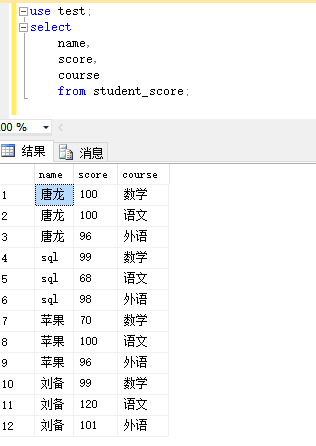
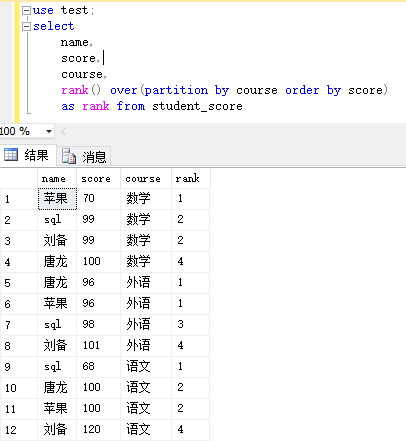
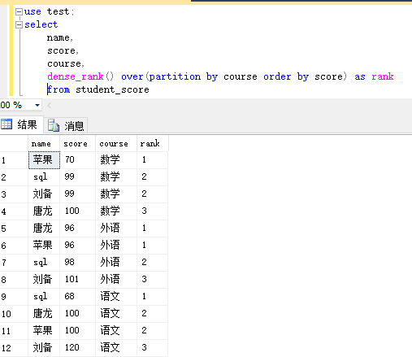
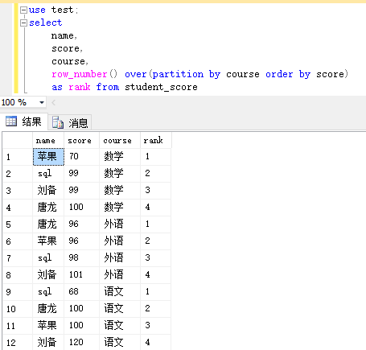

1. SET
    + 1.1 SET ANSI_NULLS 
      + 当 SET QUOTED_IDENTIFIER 为 ON 时标识符可以由双引号分隔，而文字必须由单引号分隔。
      + 当 SET QUOTED_IDENTIFIER 为 OFF 时标识符不可加引号。
    + 1.2 SET QUOTED_IDENTIFIER
      + SQL-92 标准要求在对空值进行等于 (=) 或不等于 (<>) 比较时取值为 FALSE。
      + 当 SET ANSI_NULLS 为 ON 时
        + 即使 column_name 中包含空值，使用 WHERE column_name = NULL 的 SELECT 语句仍返回零行。
        + 即使 column_name 中包含非空值，使用 WHERE column_name <> NULL 的 SELECT 语句仍会返回零行。
    + 1.3 SETANSI_PADDING
        + SET ANSI_PADDING为ON时，将允许空值的Char(n)和binary(n)列填充到列长
        + 当SE TANSI_PADDING为OFF时，将剪裁尾随空格和零，始终将不允许空值的Char(n)和binary(n)列填充到列长。
2. GO
 分批处理关键字，用于连接多条sql语句
 
3. 查询某一数据库中用户表的个数
```sql
select count(*) from slp.sys.all_objects where type = 'U';--U代表USER_TABLE
```
4. 获取当前时间的年月日，时分秒
```sql
select 
      DATENAME(YEAR,GETDATE())   as '年',
      DATENAME(MONTH,GETDATE())  as '月',
      DATENAME(DAY,GETDATE())    as '日',
      DATENAME(HOUR,GETDATE())   as '时',
      DATENAME(MINUTE,GETDATE()) as '分',
      DATENAME(SECOND,GETDATE()) as '秒';
```
5.排名
+ 数据表
---

---
+ rank()
```
--rank允许多个相同排名并存,但排名不连续
select col1,rank() over(partition by col0 order by col1 desc) as rank from table_name 
```
---

---
+ dense_rank()
```sql
--dense_rank允许多个相同排名并存,且排名连续
select col1,dense_rank() over(partition by col0 order by col1 desc) as rank from table_name 
```
---

---
+ row_number()
```sql
--row_number不允许多个相同排名并存,排名连续
select col1,row_number() over(partition by col0 order by col1 desc) as rank from table_name 
```
---

---
